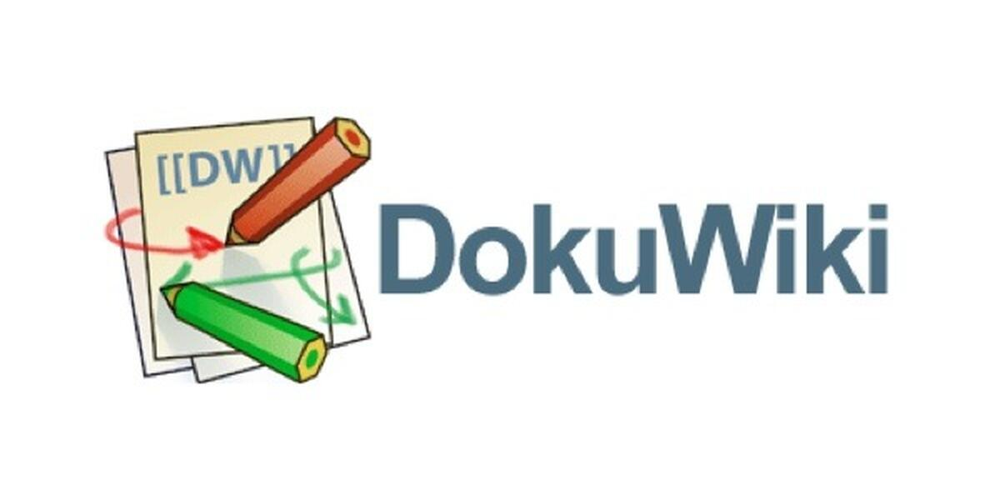

## Daftar Isi
- [Sekilas Tentang](#sekilas-tentang)
- [Instalasi](#instalasi)
- [Konfigurasi](#konfigurasi)
- [Otomatisasi](#otomatisasi)
- [Cara Pemakaian](#cara-pemakaian)
- [Pembahasan](#pembahasan)
- [Referensi](#referensi)

## Sekilas Tentang
[`^ kembali ke atas ^`](#)

**DokuWiki** adalah aplikasi _wiki open source_ yang sederhana, ringan, dan tidak memerlukan database untuk berjalan. Semua data disimpan dalam bentuk file teks, sehingga instalasi dan pemeliharaannya sangat mudah. **DokuWiki** digunakan di kalangan pengguna yang membutuhkan sistem dokumentasi cepat, aman, dan efisien. **DokuWiki** dirancang untuk kolaborasi, dimana setiap orang yang memiliki akses dapat membuat, mengedit, maupun memperbarui halaman dengan mudah. Setiap perubahan yang dilakukan juga otomatis tersimpan dalam riwayat, sehingga kita bisa melihat siapa yang mengubah apa, dan mengembalikannya.  


## Instalasi
[`^ kembali ke atas ^`](#)

**Kebutuhan Sistem :**
- Unix, Linux atau Windows.
- Apache, Nginx, IIS, atau web server lain yang mendukung PHP.
- PHP 7.2+
- RAM minimal 32 Mb+


**Proses Instalasi**
1. Download DokuWiki
   - Dapat diakses melalui link dokuwiki.org
     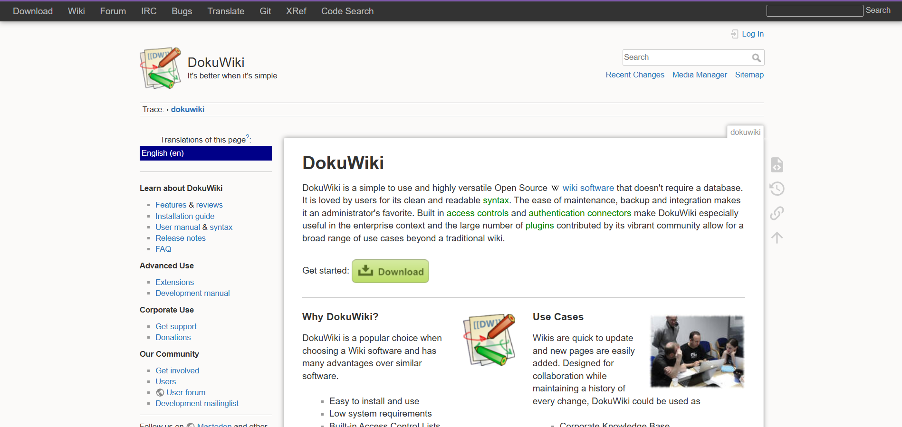
   - Dapat git clone melalui terminal

   ```bash
   git clone https://github.com/dokuwiki/dokuwiki
   ```
2. Pastikan XAMPP sudah terpasang pada perangkat, masukkan file DokuWiki yang sudah di download kedalam folder
   ```bash
   C:\xampp\htdocs\
   ```
3. Buka XAMPP dan start Apache
   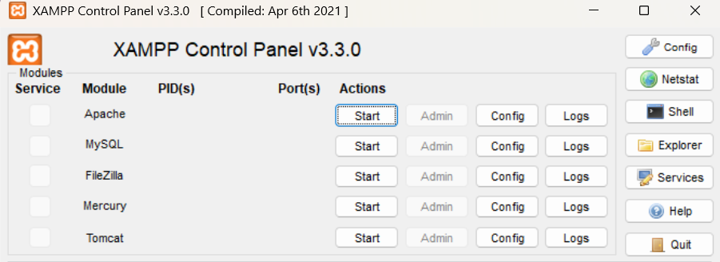
4. DokuWiki dapat di akses local melalui link berikut
   ```bash
   http://localhost/dokuwiki/
   ```
5. DokuWiki sudah dapat digunakan dalam localhost
   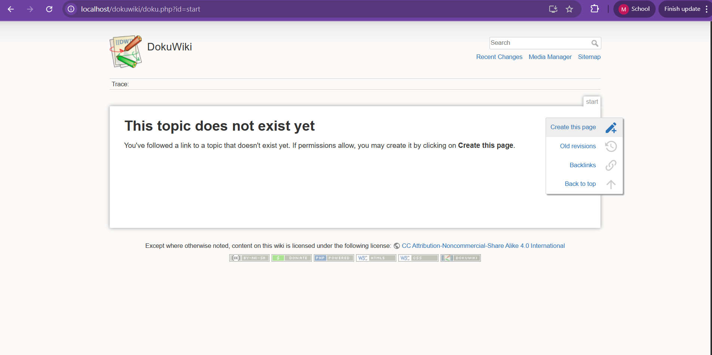

## Konfigurasi 

**Setting Server**
1. Setelah proses instalasi, setting konfigurasi dengan memebuka file php.ini pada text editor (Notepad++ / nano / vim)
   ```bash
   C:\xampp\php\php.ini
   ```
2. Cari baris upload_max_filesize, post_max_size, memory_limit, max_execution_time dan atur sesuai kebutuhan
   - Batas upload file 
   - Batas memori → agar stabil jika halaman/file besar
   - Maksimum execution time → menghindari timeout
   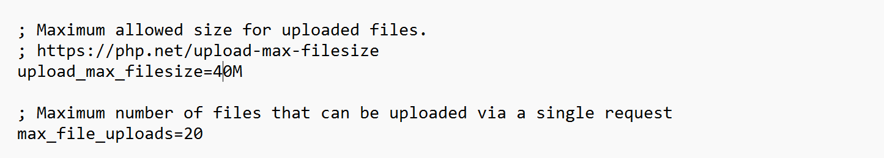
   
4. Restart Apache untuk mengaktifkan perubahan
   XAMPP → klik Stop lalu Start di Apache
   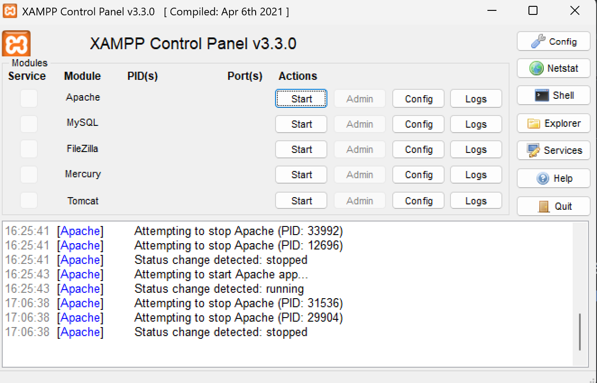


Plugin untuk fungsi tambahan
- login dengan Google/Facebook
- editor Markdown
- dll


##  Maintenance (opsional)

Setting tambahan untuk maintenance secara periodik, misalnya:
- buat backup database tiap pekan
- hapus direktori sampah tiap hari
- dll


## Otomatisasi (opsional)

Skrip shell untuk otomatisasi instalasi, konfigurasi, dan maintenance.


## Cara Pemakaian
[`^ kembali ke atas ^`](#)
1.  ### Membuka Website Hasil Deploy
   - Akses alamat web berikut.  
   [DokuWiki Deployment](https://kdjk-kelompok-brph-e3hmfxf4gke0d2dq.southeastasia-01.azurewebsites.net/dokuwiki/doku.php?id=start)
   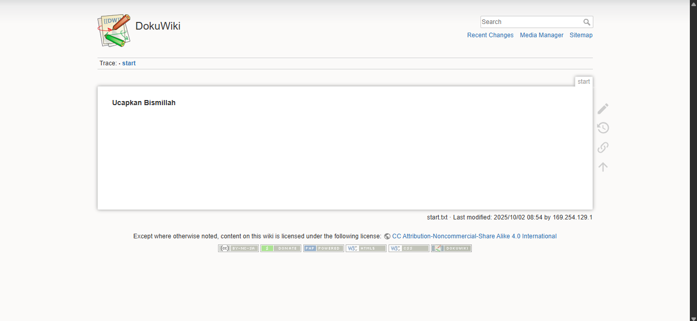

2.  **Membuka/Membuat Halaman**
   - Masukkan nama halaman pada **kotak pencarian**.
     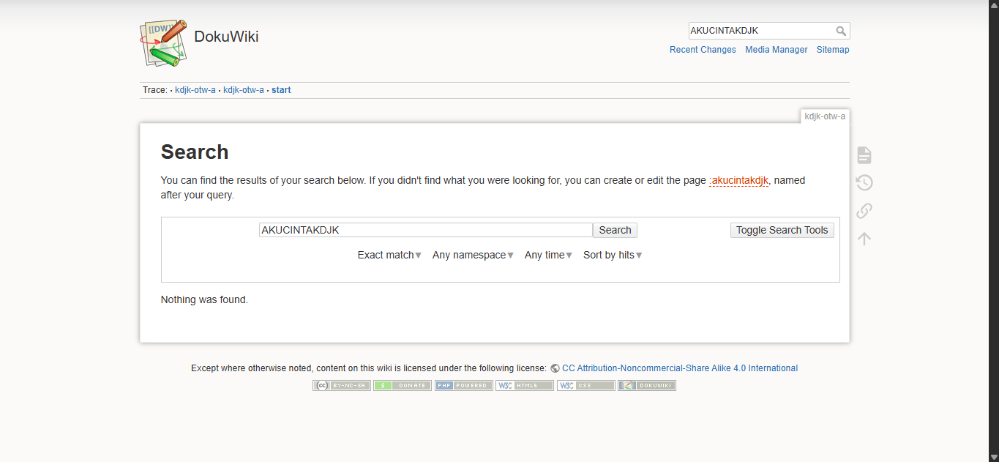
   - Jika halaman belum ada, klik ":[nama halaman]" untuk membuat halaman baru.
   - Halaman bisa dikelompokkan dalam **namespace** (mirip folder).
     Contoh: `mutu:kdjk-otw-a`
     
3. **Mengedit Halaman**
   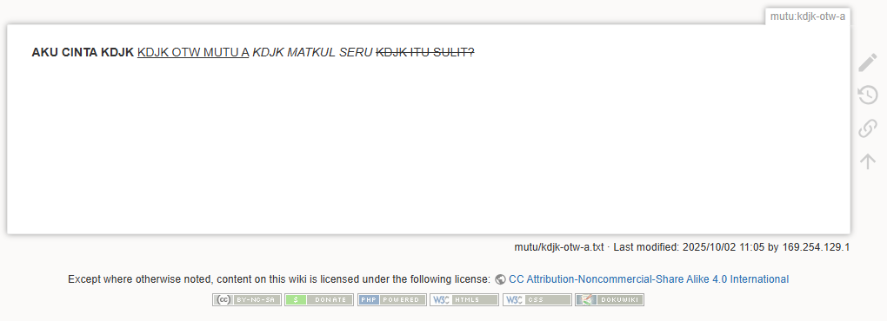
   1. Klik tombol **Edit this page** di bagian atas halaman.
      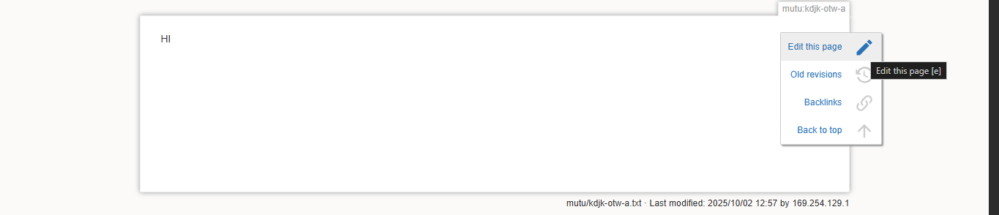
   2. Edit halaman dengan _toolbar_
      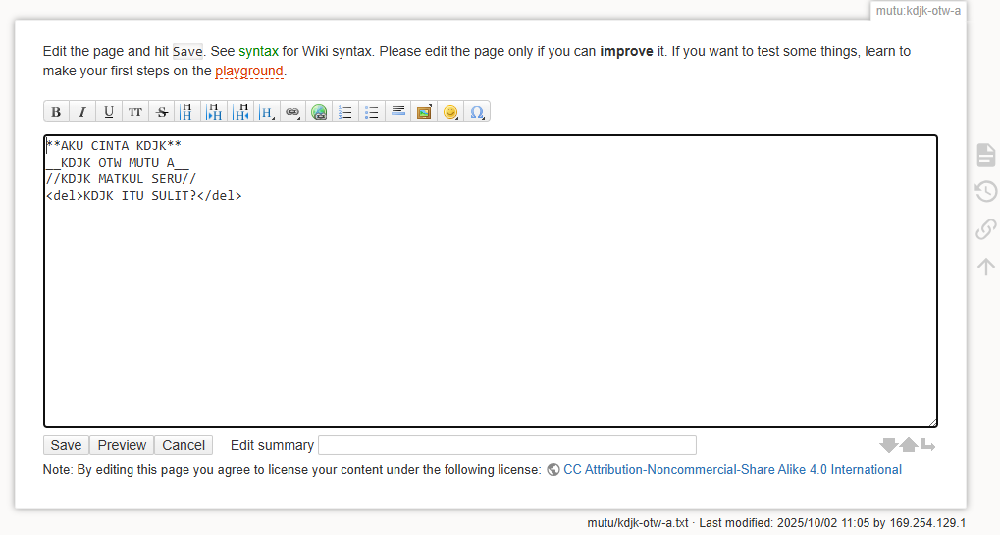
      - Berikut penjelasan ditur dalam _toolbar_:
      - B → Bold
         - Membuat teks tebal.
         - Sintaks: `**teks**` → teks
      - I → Italic
         - Membuat teks miring.
         - Sintaks: `//teks//` → teks
      - U → Underline
         - Membuat teks bergaris bawah.
         - Sintaks: `__teks__` → <u>teks</u>
      - TT → Monospaced (teks kode)
         - Menampilkan kode atau teks tetap.
         - Sintaks: `''teks''` → teks
      - H1, H2, H3, H4, H5 → Heading
         - Membuat judul dengan level berbeda.
         - Sintaks: `===== Heading 1 =====`, `==== Heading 2 ====`, `=== Heading 3 ===`, `== Heading 4 ==`, `= Heading 5 =`
      - Rantai (🔗) → Insert Link
         - Membuat tautan ke halaman lain atau URL.
         - Sintaks: `[[halaman:lain|Teks Link]]`, `[[https://example.com|Website]]`
      - Gambar (🖼️) → Insert Image
         - Menyisipkan gambar dari Media Manager.
         - Sintaks: `{{:gambar.png}}`, `{{https://example.com/logo.png}}`
      - Daftar Bullet (•) → Unordered List
         - Sintaks: `* Item 1`, `* Item 2`
      - Daftar Angka (1. 2. 3.) → Ordered List
         - Sintaks: `- Item 1`, `- Item 2`
      - Emoji/Smiley (😊) → Menyisipkan emoticon bawaan.
         - Contoh: `:)` → 🙂 , `:(` → ☹️
      - Ω (Omega) → Special Characters
         - Untuk menambahkan karakter khusus (simbol Yunani, matematika, dll).
          
4. **Mengunggah dan Menyisipkan Media**
   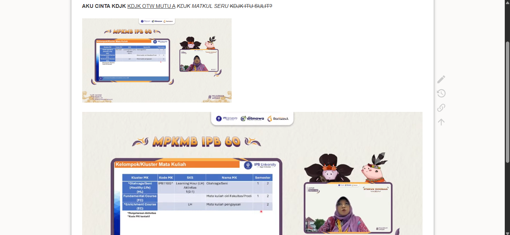
   - Klik menu Media Manager di bagian atas.
    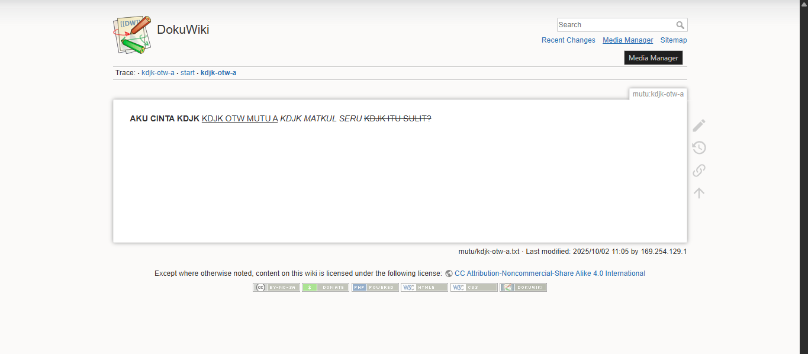
   - Pilih folder/namespace tempat file akan disimpan.
    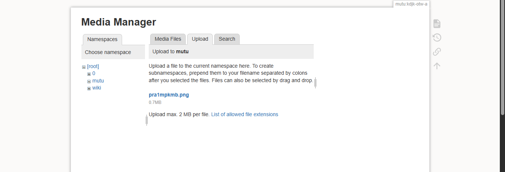
   - Klik Browse/Choose File, pilih gambar atau dokumen dari komputer, lalu tekan Upload.
    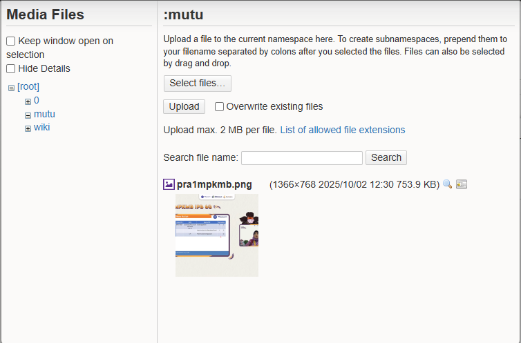
   - Untuk menambahkan gambar di halaman, gunakan ikon Insert Image (🖼️) atau ketik sintaks:
      ```bash
      {{:namespace:namafile.png}}
      ```
     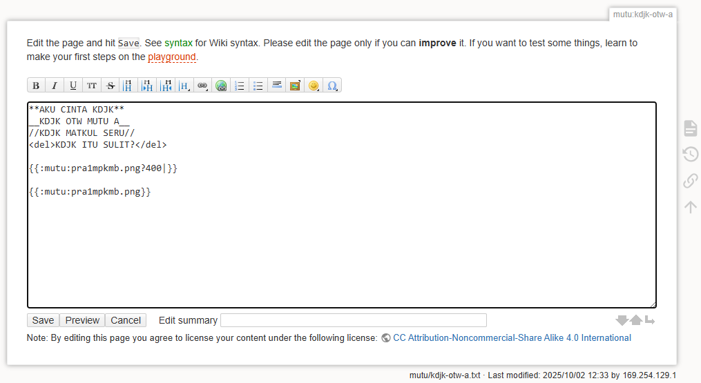


## Pembahasan
- Pendapat anda tentang aplikasi web ini
  
    - **Kelebihan**
      1. **Mudah Diinstal dan Digunakan**: DokuWiki hanya butuh PHP dan web server (Apache/Nginx) tanpa database, jadi instalasi akan terasa cepat dan mudah. Sintaks yang digunakan sederhana, yaitu toolbar, section editing, auto-save, dan breadcrumbs, sehingga pengguna baru maupun profesional bisa langsung menulis dan mengedit halaman dengan mudah.
      2. **Kebutuhan Sistem Rendah**: DokuWiki ringan karena bisa berjalan di server dengan spesifikasi kecil, hemat RAM dan CPU, serta cocok untuk server kampus atau organisasi kecil.
      3. **Manajemen Konten Fleksibel**: Mendukung _unlimited page revisions_, kategori melalui namespace, upload dan embedding media, serta link otomatis antarhalaman, membuat pengelolaan konten menjadi rapi dan mudah dicari.
      4. **Keamanan dan Kontrol Akses**: Dilengkapi Access Control List (ACL), halaman read-only, anti-spam, dan proteksi email, Dokuwiki memberikan kontrol penuh terhadap siapa yang bisa mengakses atau mengedit konten serta melindungi dari gangguan.
      5. **Mendukung Banyak Bahasa dan Global**: Mendukung lebih dari 50 bahasa termasuk Bahasa Indonesia, UTF-8, serta romanization untuk URL, cocok untuk tim lokal maupun internasional dengan navigasi halaman yang rapi.
         
    - **Kekurangan**
      1. **Skalabilitas Terbatas:** Untuk organisasi besar atau wiki dengan konten sangat dinamis, DokuWiki bisa terasa kurang cepat dan fitur yang disediakan terbatas karena pendekatan yang sederhana.
      2. **Tampilan dan Pengalaman Pengguna (UI/UX):** Interface dalam DokuWiki terlihat lebih sederhana dibanding wiki modern seperti _Confluence atau Notion_, sehingga terasa kurang menarik dan intuitif untuk pengguna yang baru menggunakan Dokuwiki.
      3. **Fitur Bawaan Terbatas:** Beberapa fungsi tambahan dalam DokuWiki harus diinstal terlebih dahulu melalui plugin agar wiki memiliki fitur yang lengkap sesuai kebutuhan pengguna.
         
Salah satu CMS yang memiliki tipe serupa dengan DokuWiki adalah BookStack. Keduanya sama-sama digunakan sebagai platform dokumentasi, namun memiliki perbedaan dari sisi fitur, penggunaan, dan kebutuhan teknis.

Kelebihan DokuWiki dibandingkan BookStack antara lain:
1. **Akses publik yang mudah**. DokuWiki dapat diakses secara terbuka tanpa login sehingga cocok digunakan untuk dokumentasi publik dan open knowledge base. Sebaliknya, BookStack secara default bersifat tertutup, sehingga seluruh konten hanya dapat diakses setelah pengguna login.
2. **Instalasi yang ringan**. DokuWiki tidak membutuhkan database sehingga instalasi lebih sederhana dan performa lebih stabil dengan beban server yang rendah. Sementara itu, BookStack membutuhkan database (seperti MySQL/MariaDB) sehingga setup relatif lebih kompleks dan berat.
3. **Fleksibilitas kustomisasi**. DokuWiki mendukung banyak plugin dan ekstensi, misalnya tema, diagram, atau export PDF, sehingga dapat disesuaikan dengan berbagai kebutuhan use case. Pada BookStack, opsi kustomisasi lebih terbatas karena fokusnya adalah pada dokumentasi sederhana.

Kekurangan DokuWiki dibandingkan BookStack antara lain:
1. **Antarmuka sederhana**. UI/UX DokuWiki cenderung minimalis dan terlihat kuno, sehingga pengalaman pengguna terasa kurang modern jika dibandingkan dengan BookStack yang lebih intuitif.
2. **Autentikasi terbatas**. DokuWiki hanya menyediakan autentikasi internal sederhana secara bawaan. Sebaliknya, BookStack sudah mendukung integrasi autentikasi modern seperti LDAP atau SSO.
3. **Learning-curve lebih tinggi**. DokuWiki membutuhkan pengetahuan tentang sintaks wiki untuk membuat konten, sehingga kurang ramah bagi pengguna non-teknis. BookStack lebih mudah dipahami karena antarmukanya mirip dengan aplikasi pengolah dokumen populer seperti Word atau Notion.

## Referensi
1. [About DokuWiki](https://www.dokuwiki.org/dokuwiki)
2. [Wiki Comparison](https://xtom.com/blog/self-hosted-wiki/)
3. [BookStack vs DokuWiki: Comparison](https://sourceforge.net/software/compare/BookStack-vs-DokuWiki/)

